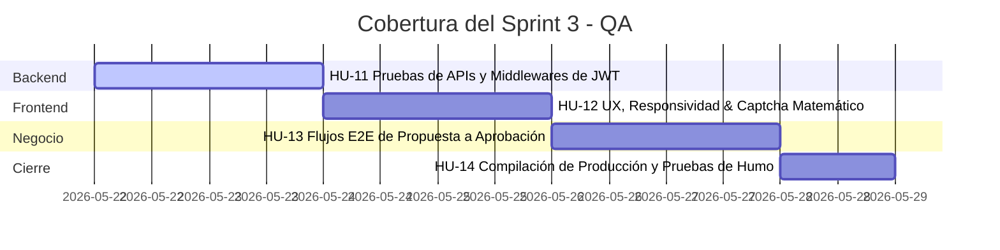

# 🍲 Sabores de Tlaxcala — Plataforma Gastronómica Integral

> **Proyecto Oficial de Difusión Gastronómica y Gestión de Recetas** desarrollado para la **Secretaría de Turismo del Estado de Tlaxcala**. Esta plataforma representa la evolución y migración de una solución monolítica heredada hacia una robusta arquitectura full-stack moderna construida con **React, Node.js (Express) y MongoDB**.

---

## 📑 Tabla de Contenidos

1. [Contexto del Proyecto](#-contexto-del-proyecto)
2. [Arquitectura del Sistema](#%EF%B8%8F-arquitectura-del-sistema)
3. [Características Clave](#-caracter%C3%ADsticas-clave)
4. [Estructura del Repositorio](#-estructura-del-repositorio)
5. [Requisitos Previos](#-requisitos-previos)
6. [Instalación y Configuración](#-instalaci%C3%B3n-y-configuraci%C3%B3n)
   - [Configuración del Backend](#1-configuraci%C3%B3n-del-backend)
   - [Configuración del Frontend](#2-configuraci%C3%B3n-del-frontend)
7. [Catálogo de API Endpoints](#-cat%C3%A1logo-de-api-endpoints)
8. [Diseño Visual e Identidad](#-dise%C3%B1o-visual-e-identidad)
9. [Plan de Pruebas y QA (Sprint 3)](#-plan-de-pruebas-y-qa-sprint-3)
10. [Licencia y Autoría](#-licencia-y-autor%C3%ADa)

---

## 🏛️ Contexto del Proyecto

La gastronomía tlaxcalteca es un pilar cultural intangible del país, lleno de historia, ingredientes nativos y saberes compartidos por generaciones de cocineras tradicionales. Para facilitar la preservación y divulgación formal de este patrimonio, la **Secretaría de Turismo** solicitó la creación de una plataforma interactiva que cumpliera con rigurosos criterios de recopilación de recetas y verificación de seguridad.

La plataforma **Sabores de Tlaxcala** resuelve estas necesidades mediante:
*   Un catálogo público dinámico filtrable por categorías gastronómicas.
*   Un flujo formal para que cocineros tradicionales propongan y editen recetas de forma estructurada.
*   Un panel administrativo para el control total del contenido, moderación de propuestas y administración de cuentas.

---

## ⚙️ Arquitectura del Sistema

La aplicación está diseñada bajo el principio de **Monolito Modular con Clean Architecture (Arquitectura en Capas)** en el Backend y una **Estructura de Componentes React Inyectados por Contexto** en el Frontend. 

### Diagrama General (Modelo 4+1 Vistas)

```mermaid
graph TD
    subgraph Capa de Cliente (React.js + Vite)
        UI[UI Components & Modales]
        State[AuthContext & Modals State]
        UI --> State
    end

    subgraph Capa de Servidor (Express.js REST API)
        Routes[Routes & Middlewares]
        Controllers[Controllers]
        Routes --> Controllers
    end

    subgraph Capa de Datos (MongoDB Atlas)
        Mongoose[Mongoose Models - User / Recipe]
        DB[(NoSQL Database Cluster)]
        Mongoose --> DB
    end

    State -- HTTP Requests / Axios --> Routes
    Controllers --> Mongoose
```

---

## 🌟 Características Clave

1. **Estructura de Recetas de 6 Secciones (Obligatoria):**
   Para asegurar el rigor del inventario cultural, cada receta propuesta debe contener obligatoriamente:
   *   *Ficha Técnica Básica:* Nombre, origen, dificultad, tiempo de cocción, porciones y **calorías**.
   *   *Visuales:* Imágenes representativas (URLs validadas).
   *   *Ingredientes:* Listado dinámico de insumos requeridos.
   *   *Preparación:* Pasos ordenados secuencialmente de forma detallada.
   *   *Breviario Histórico:* Reseña de valor cultural que contextualiza el origen del platillo.
   *   *Datos Curiosos:* Datos antropológicos o tradicionales del platillo.

2. **Flujo y Moderación de Propuestas:**
   *   **Visitante:** Solo puede leer y filtrar recetas en estado `"aprobada"`.
   *   **Usuario (Cocinera Tradicional):** Puede registrarse, ingresar y proponer platillos. Sus propuestas ingresan al sistema con estado `"pendiente"` y no son visibles públicamente hasta que un administrador las evalúe.
   *   **Administrador:** Puede aprobar o rechazar propuestas, además de tener control total CRUD sobre cualquier receta.

3. **Autenticación Segura (JWT) y Control de Roles:**
   La sesión es *stateless* y se gestiona mediante tokens de acceso firmados (**JSON Web Tokens**). El almacenamiento en el cliente utiliza `localStorage` con inyección global a través de `AuthContext`.

4. **Captcha Matemático de Registro:**
   Para prevenir registros automatizados por parte de bots, el modal de creación de cuenta plantea operaciones aritméticas aleatorias. Si la respuesta provista no coincide con el resultado exacto, el envío se bloquea visualmente y lanza alertas informativas en tiempo real.

5. **PIN Maestro Administrativo:**
   La creación de cuentas con privilegios de Administrador (`admin`) está protegida mediante la validación obligatoria en el backend de un **PIN Maestro** de seguridad (`1234`), mitigando la escalada de privilegios no autorizada.

---

## 📂 Estructura del Repositorio

El proyecto cuenta con una separación limpia entre las capas de presentación frontend y la lógica de backend:

```text
resetas-de-tlaxcala/
├── backend/
│   ├── index.js                     # Servidor Express y middlewares generales
│   ├── .env                         # Variables de entorno (puertos, URI y JWT)
│   ├── package.json                 # Dependencias y scripts del Backend
│   ├── scripts/
│   │   └── seed.js                  # Semilla de inicialización de la Base de Datos
│   └── src/
│       ├── domain/                  # Capa 1: Modelos de datos del negocio (Núcleo)
│       │   └── models/
│       │       ├── User.js          # Modelo de Mongoose para Usuarios
│       │       └── Recipe.js        # Modelo de Mongoose para Recetas (6 secciones)
│       ├── infrastructure/          # Capa 2: Servicios de Infraestructura
│       │   └── db/
│       │       └── connection.js    # Conector oficial de Mongoose a MongoDB
│       └── interfaces/              # Capa 3: Controladores, Rutas y Middleware
│           ├── controllers/
│           │   ├── authController.js
│           │   └── recipeController.js
│           ├── middleware/
│           │   └── authMiddleware.js # Guardianes de autenticación JWT y roles
│           └── routes/
│               ├── authRoutes.js
│               └── recipeRoutes.js
│
├── frontend/
│   ├── index.html                   # HTML Base del Cliente
│   ├── package.json                 # Dependencias y empaquetador del Frontend
│   ├── vite.config.js               # Configuración del motor Vite
│   └── src/
│       ├── main.jsx                 # Punto de entrada de React
│       ├── App.jsx                  # Enrutador principal y layouts base
│       ├── index.css                # Sistema de Diseño y tokens de color CSS
│       ├── context/
│       │   └── AuthContext.jsx      # Proveedor de sesión y estados de modales
│       ├── components/              # Componentes funcionales y Modales
│       │   ├── Header.jsx           # Navbar de navegación principal
│       │   ├── LoginModal.jsx       # Interfaz de ingreso
│       │   ├── RegisterModal.jsx    # Registro + Captcha Matemático
│       │   ├── RecipeDetailModal.jsx# Detalle tabulado en 3 pestañas elegantes
│       │   ├── RecipeFormModal.jsx  # Formulario interactivo CRUD (Crear/Editar)
│       │   └── CreateAdminModal.jsx # Panel de registro de Admins con PIN Maestro
│       └── pages/                   # Vistas principales de página
│           ├── Home.jsx             # Presentación, estadísticas y destacados
│           ├── Recetas.jsx          # Catálogo con buscador y filtros
│           ├── Historia.jsx         # Espacio cultural tlaxcalteca
│           └── Admin.jsx            # Panel tabulado de control para Administradores
```

---

## 🛠️ Requisitos Previos

Asegúrate de contar con los siguientes elementos instalados en tu máquina local antes de iniciar:

*   **Node.js** (Versión 18.0.0 o superior recomendada).
*   **npm** (Gestor de paquetes de Node, incluido por defecto).
*   Una cuenta y clúster activo en **MongoDB Atlas** (o una instancia local de MongoDB en ejecución).

---

## 🚀 Instalación y Configuración

Sigue estos pasos detallados para poner en marcha los entornos del sistema de manera local:

### 1. Configuración del Backend

1. Navega al directorio del backend desde la terminal:
   ```bash
   cd backend
   ```

2. Instala todas las dependencias del servidor:
   ```bash
   npm install
   ```

3. Crea un archivo `.env` en la raíz de la carpeta `/backend` y define las variables de entorno necesarias. Ejemplo de configuración:
   ```env
   PORT=5000
   MONGO_URI=mongodb+srv://tu_usuario:tu_contraseña@tu_cluster.mongodb.net/cocina_tlaxcala?retryWrites=true&w=majority
   JWT_SECRET=tu_secreto_super_seguro_para_firmar_tokens_jwt
   ```

4. **Inicialización de la Base de Datos (Seeding):**
   Ejecuta el script de semilla preconfigurado para limpiar la base de datos e inyectar un usuario administrador principal, un usuario cocinero de prueba y el primer platillo tradicional destacado (*Mole Prieto Tlaxcalteca*):
   ```bash
   node scripts/seed.js
   ```
   *Salida esperada:*
   ```text
   ⚠️ Limpiando base de datos...
   👤 Creando usuarios...
   🍲 Creando recetas...
   ✅ Datos iniciales exportados a MongoDB correctamente.
   ```

5. Inicia el servidor en modo de desarrollo (utiliza `nodemon` para reinicios automáticos ante cambios):
   ```bash
   npm run dev
   ```
   *El backend estará escuchando activamente peticiones en el puerto `5000`.*

---

### 2. Configuración del Frontend

1. Abre una nueva terminal y navega al directorio del frontend:
   ```bash
   cd frontend
   ```

2. Instala los módulos requeridos por la interfaz del cliente:
   ```bash
   npm install
   ```

3. Arranca el servidor de desarrollo de Vite:
   ```bash
   npm run dev
   ```

4. Abre tu navegador web en la dirección local provista por la consola:
   ```text
   http://localhost:5173
   ```

---

## 🔌 Catálogo de API Endpoints

El backend expone las siguientes rutas protegidas y públicas organizadas por recursos:

### Autenticación e Identidad (`/api/auth`)

| Método | Endpoint | Acceso | Descripción | Body Requerido |
| :--- | :--- | :--- | :--- | :--- |
| **POST** | `/api/auth/register` | Público | Registra una nueva cocinera tradicional. | `{ name, lastName, email, password, specialty }` |
| **POST** | `/api/auth/login` | Público | Autentica un usuario y retorna sus datos junto con el Token JWT. | `{ email, password }` |
| **GET** | `/api/auth/users` | Admin | Lista todas las cuentas registradas en el sistema. | *Ninguno (JWT en Cabecera)* |
| **POST** | `/api/auth/create-admin` | Admin | Crea un nuevo administrador verificando el PIN Maestro. | `{ name, lastName, email, password, masterPin }` |
| **PUT** | `/api/auth/users/:id` | Admin | Actualiza el rol o especialidad de un usuario específico. | `{ name, lastName, email, specialty, role }` |
| **DELETE** | `/api/auth/users/:id` | Admin | Elimina de forma permanente una cuenta del sistema. | *Ninguno (JWT en Cabecera)* |

---

### Control de Recetas (`/api/recipes`)

| Método | Endpoint | Acceso | Descripción | Parámetros / Body |
| :--- | :--- | :--- | :--- | :--- |
| **GET** | `/api/recipes` | Público | Retorna todas las recetas aprobadas para el público. | *Ninguno* |
| **GET** | `/api/recipes/stats` | Público | Retorna las métricas cuantitativas agregadas para el Home. | *Ninguno* |
| **GET** | `/api/recipes/:id` | Público | Obtiene el desglose completo de una sola receta por su ID. | `id` (En URL) |
| **GET** | `/api/recipes/all` | Admin | Lista todas las recetas registradas en la BD sin filtros. | *Ninguno (JWT en Cabecera)* |
| **GET** | `/api/recipes/pending` | Admin | Filtra recetas que aguardan aprobación en la moderación. | *Ninguno (JWT en Cabecera)* |
| **POST** | `/api/recipes` | Registrado | Registra una propuesta gastronómica (entra como `"pendiente"`). | Objeto JSON con las 6 secciones de receta. |
| **PUT** | `/api/recipes/:id` | Autor/Admin | Modifica los datos técnicos de una receta. | Objeto parcial o total a actualizar. |
| **DELETE** | `/api/recipes/:id` | Autor/Admin | Elimina físicamente una receta de la base de datos. | *Ninguno (JWT en Cabecera)* |
| **PUT** | `/api/recipes/:id/status`| Admin | Aprueba o rechaza formalmente una receta en cola de espera. | `{ status: "aprobada" | "rechazada" }` |

> [!NOTE]
> Para todas las peticiones con Acceso de `Registrado` o `Admin`, se debe adjuntar el token JWT en las cabeceras HTTP:
> `Authorization: Bearer <TU_TOKEN_JWT>`

---

## 🎨 Diseño Visual e Identidad

El frontend cuenta con un sistema de diseño premium, cálido y minimalista, inspirado en el maíz nativo y las haciendas coloniales de Tlaxcala. Implementado en Vanilla CSS (`frontend/src/index.css`), incluye los siguientes tokens clave:

*   🟤 **Terracota Ancestral (`--primary`: `#5c2518`):** Representa el color de las cazuelas de barro tradicionales.
*   🟡 **Maíz Dorado (`--secondary`: `#e6a15c`):** Rinde homenaje a las variedades de maíz nativo tlaxcalteca.
*   🌕 **Acentos Dorados (`--gold`: `#b8860b`):** Delimita bordes e insignias de moderación administrativa.
*   ⚪ **Papel Amate (`--bg-cream`: `#faf6f0`):** Reemplaza el color blanco plano por un fondo cálido tipo pergamino para facilitar la lectura fluida.
*   🛡️ **Efecto de Cristal Moderno (`--glass-bg`):** Modales con `backdrop-filter: blur(12px)` para centrar la atención del usuario en formularios clave sin perder contexto.

---

## 🧪 Plan de Pruebas y QA (Sprint 3)

El ciclo de desarrollo concluyó con un riguroso Sprint enfocado en la fiabilidad del sistema bajo 4 pilares:



*   **Pruebas de Seguridad en API:** Validación de respuesta HTTP `401 Unauthorized` al intentar perturbar las peticiones mediante Tokens alterados o ausentes.
*   **Pruebas de Caja Negra en Interfaz:** Verificación de adaptabilidad responsive en pantallas móviles utilizando simuladores Chrome DevTools y mitigación de inputs incompletos.
*   **Prueba E2E de Aprobación de Recetas:** Registro de usuario -> Creación de propuesta -> Validación de exclusión de catálogo público -> Login de Admin -> Aprobación formal -> Confirmación de visibilidad global.

---

## 👥 Licencia y Autoría

*   **Desarrollo:** Proyecto Integral Académico-Profesional de Migración Full-Stack.
*   **Destinatario:** Secretaría de Turismo del Estado de Tlaxcala.
*   **Licencia:** Uso Exclusivo Institucional y Formación Técnica.

---
*¡Buen provecho! Explora, cocina y preserva la herencia culinaria de Tlaxcala.* 🍲✨
