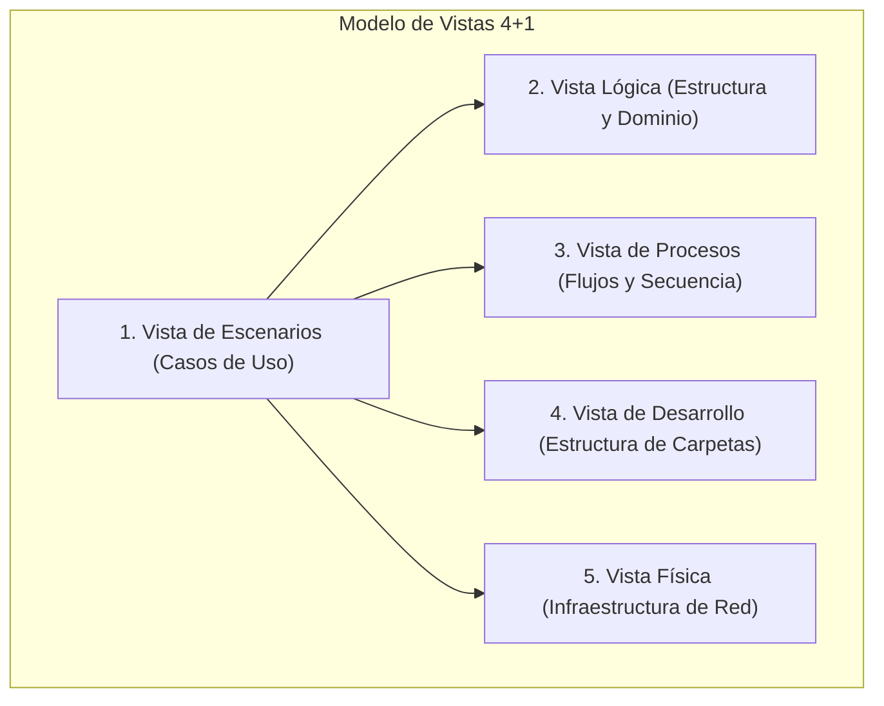
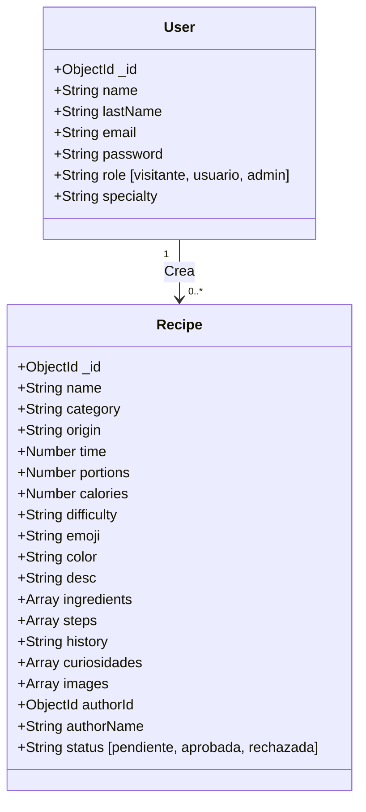
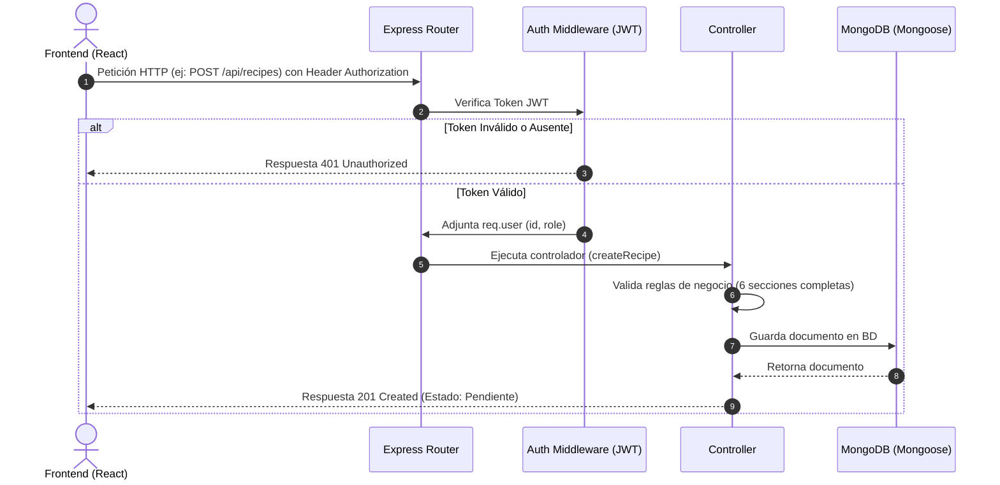

# Documentación Técnica del Backend: "Sabores de Tlaxcala"
## Arquitectura: Monolito Modular + Clean Architecture (Modelo 4+1 Vistas)

Este documento detalla la arquitectura, estructura de datos y diseño lógico del backend desarrollado en **Node.js, Express.js y MongoDB** para el sistema de difusión gastronómica de Tlaxcala.

---

## 1. El Modelo de Vistas 4+1 (Kruchten)

Para ilustrar de manera formal la arquitectura del sistema, se utiliza el modelo de vistas **4+1**, describiendo el software desde múltiples perspectivas de los stakeholders.



### 1.1 Vista de Escenarios (Casos de Uso)
Define los requerimientos que impulsan el diseño del sistema a través de las interacciones de los distintos actores.

*   **Actor: Visitante**
    *   *CU-01*: Visualizar todas las recetas tradicionales aprobadas.
    *   *CU-02*: Consultar breviarios históricos de los platillos.
    *   *CU-03*: Visualizar estadísticas globales (número de recetas, cocineros, municipios y lecturas).
*   **Actor: Usuario Registrado (Cocinero/a)**
    *   *CU-04*: Crear cuenta y registrarse validando Captcha matemático.
    *   *CU-05*: Iniciar sesión (Auth JWT).
    *   *CU-06*: Proponer nuevas recetas completando las 6 secciones obligatorias.
    *   *CU-07*: Modificar sus propias recetas.
*   **Actor: Administrador**
    *   *CU-08*: Validar, aprobar o rechazar nuevas recetas en cola de espera.
    *   *CU-09*: Añadir, modificar o eliminar cualquier receta en la BD.
    *   *CU-10*: Modificar roles de usuarios o eliminarlos del sistema.
    *   *CU-11*: Crear nuevos administradores autorizados mediante **PIN Maestro**.

---

### 1.2 Vista Lógica
Muestra la organización del diseño interno (el modelo de dominio) y cómo se implementan los requerimientos usando la abstracción de Clean Architecture.

#### Modelo de Dominio (Mongoose Schemas)



*   **User Schema**: Define las propiedades de los actores con control de credenciales encriptadas en `bcrypt` y roles estrictos.
*   **Recipe Schema**: Estructura de datos que encapsula obligatoriamente las **6 secciones requeridas** por la Secretaría de Turismo, incluyendo **calorías** e **imágenes obligatorias** (al menos una).

---

### 1.3 Vista de Procesos
Ilustra la dinámica de ejecución del sistema, centrándose en el flujo de peticiones, control de concurrencia y validaciones de seguridad.

#### Flujo de Peticiones y Middleware de Seguridad



---

### 1.4 Vista de Desarrollo (Implementación)
Muestra cómo se organiza físicamente el código fuente en módulos y capas lógicas (Clean Architecture).

```
backend/
├── index.js                     # Servidor de Express y carga de middlewares
├── .env                         # Variables de entorno (puertos, URI de MongoDB, JWT_SECRET)
├── package.json                 # Dependencias y scripts del sistema
├── scripts/
│   └── seed.js                  # Script de semilla para inicializar la BD
└── src/
    ├── domain/                  # Capa 1: Modelos de datos del negocio (Núcleo)
    │   └── models/
    │       ├── User.js
    │       └── Recipe.js
    ├── infrastructure/          # Capa 2: Conexión externa a Base de Datos
    │   └── db/
    │       └── connection.js
    └── interfaces/              # Capa 3: Controladores, Rutas y Seguridad
        ├── controllers/
        │   ├── authController.js
        │   └── recipeController.js
        ├── middleware/
        │   └── authMiddleware.js
        └── routes/
            ├── authRoutes.js
            └── recipeRoutes.js
```

---

### 1.5 Vista Física
Define la topología del hardware y la red sobre la cual corre el backend.

*   **Capa de Cliente**: Navegador web ejecutando el cliente React.js en el puerto local `5173`.
*   **Capa de Servidor**: Servidor de Aplicaciones web corriendo en un entorno **Node.js (v18+)** ejecutando Express en el puerto `5000`.
*   **Capa de Datos**: Base de datos **NoSQL** alojada en la nube mediante un clúster gestionado de **MongoDB Atlas** con protocolos SSL y acceso controlado por IP.

---

## 2. Catálogo de APIs e Interfaz (Endpoints)

El backend expone un conjunto de endpoints RESTful protegidos para interactuar con la base de datos:

### 2.1 Autenticación e Inicios de Sesión (`/api/auth`)

| Método | Endpoint | Acceso | Descripción | Parámetros Body |
| :--- | :--- | :--- | :--- | :--- |
| **POST** | `/api/auth/register` | Público | Registra un nuevo cocinero tradicional. | `{ name, lastName, email, password, specialty }` |
| **POST** | `/api/auth/login` | Público | Inicia sesión y genera un token JWT. | `{ email, password }` |
| **GET** | `/api/auth/users` | Admin | Obtiene el listado completo de usuarios registrados. | *Ninguno (requiere Token)* |
| **POST** | `/api/auth/create-admin` | Admin | Crea un administrador validando el PIN maestro. | `{ name, lastName, email, password, masterPin }` |
| **PUT** | `/api/auth/users/:id` | Admin | Actualiza el rol o especialidad de un usuario. | `{ name, lastName, email, specialty, role }` |
| **DELETE** | `/api/auth/users/:id` | Admin | Elimina permanentemente una cuenta de usuario. | *Ninguno (requiere Token)* |

---

### 2.2 Gestión de Recetas (`/api/recipes`)

| Método | Endpoint | Acceso | Descripción | Parámetros Body / Query |
| :--- | :--- | :--- | :--- | :--- |
| **GET** | `/api/recipes` | Público | Obtiene todas las recetas en estado **aprobada**. | *Ninguno* |
| **GET** | `/api/recipes/stats` | Público | Retorna las estadísticas agregadas para el home. | *Ninguno* |
| **GET** | `/api/recipes/all` | Admin | Obtiene la totalidad de recetas (sin filtrar estado). | *Ninguno (requiere Token)* |
| **GET** | `/api/recipes/pending` | Admin | Obtiene recetas que aguardan aprobación. | *Ninguno (requiere Token)* |
| **GET** | `/api/recipes/:id` | Público | Obtiene el detalle de una receta en particular. | `id` (Param) |
| **POST** | `/api/recipes` | Registrado | Propone una receta (entra en cola de revisión). | Objeto completo con las 6 secciones. |
| **PUT** | `/api/recipes/:id` | Autor/Admin | Modifica los datos de una receta existente. | Objeto parcial o total a modificar. |
| **DELETE** | `/api/recipes/:id` | Autor/Admin | Elimina una receta de forma lógica de la BD. | *Ninguno (requiere Token)* |
| **PUT** | `/api/recipes/:id/status`| Admin | Aprueba o rechaza una receta en espera. | `{ status: "aprobada" o "rechazada" }` |

---

## 3. Políticas de Seguridad y Reglas de Negocio Estrictas

1.  **Protección de Contraseñas**: Las claves se hashean antes de guardarse en la base de datos usando el algoritmo unidireccional de derivación de claves **bcrypt** con un factor de trabajo salt de `10`.
2.  **Manejo de Sesiones**: Se realiza de manera *Stateless* usando **JSON Web Tokens (JWT)**. Las rutas protegidas validan la firma del token en el encabezado `Authorization: Bearer <token>`.
3.  **Flujo de Aprobación de Recetas**:
    *   Si una receta es cargada por un usuario de rol `usuario`, se inserta con `status: "pendiente"`. No aparecerá en las consultas públicas de visitantes.
    *   Si es subida por un `admin`, se publica de forma automática (`status: "aprobada"`).
    *   El administrador debe aprobarla explícitamente en el panel para hacerla pública.
4.  **PIN Maestro**: La API de creación de administradores `/api/auth/create-admin` exige obligatoriamente enviar la clave de autorización `masterPin` con valor exacto a `'1234'`.
