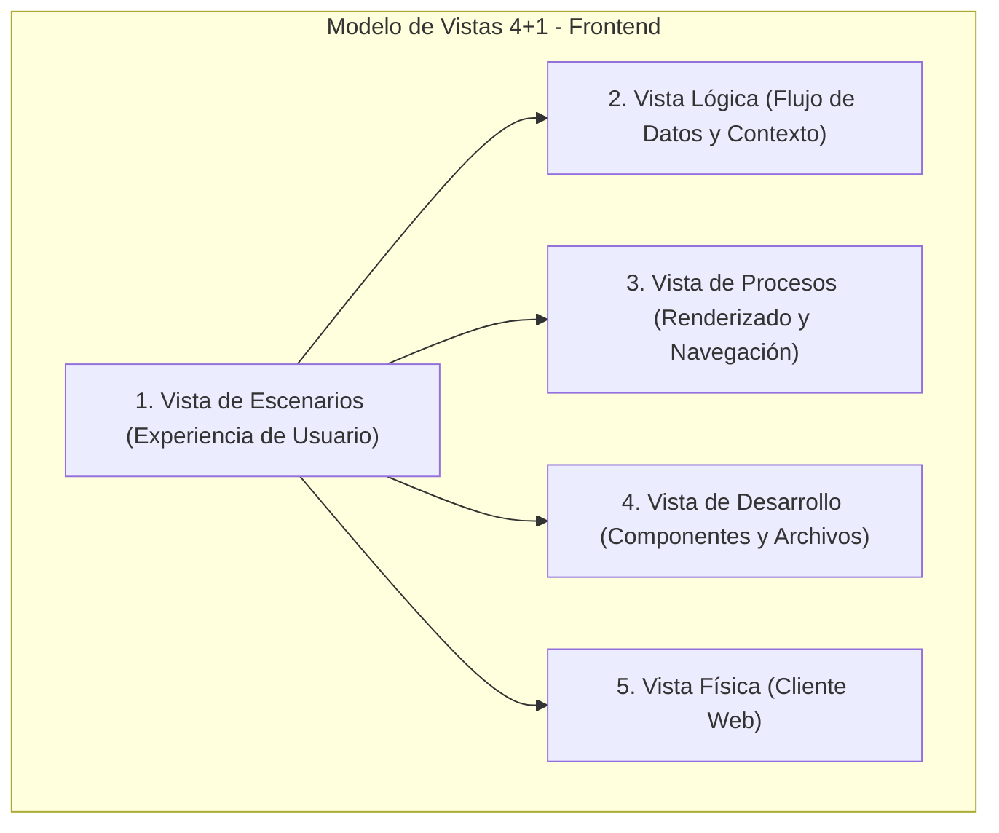
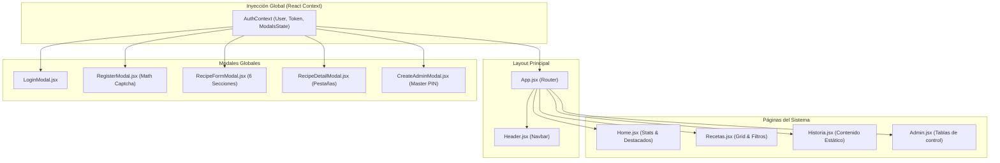
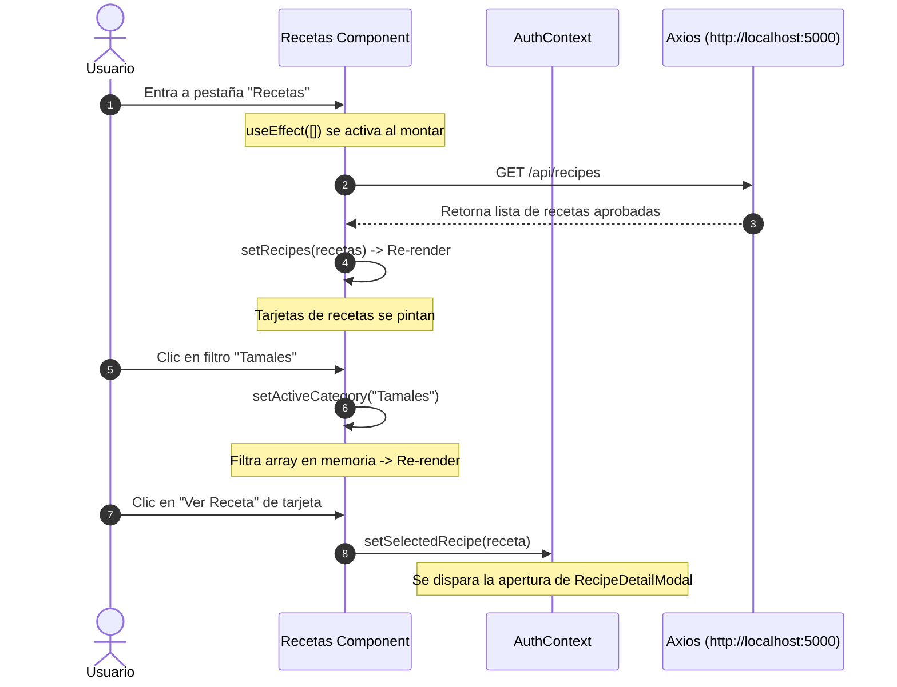

# Documentación Técnica del Frontend: "Sabores de Tlaxcala"
## Arquitectura de Cliente: React.js + Vite.js (Modelo 4+1 Vistas)

Este documento detalla la arquitectura de cliente, jerarquía de componentes, gestión de estados y diseño estético del frontend desarrollado para la plataforma gastronómica de Tlaxcala.

---

## 1. El Modelo de Vistas 4+1 (Kruchten) en Frontend

Adaptamos el modelo formal **4+1** para analizar la interfaz de usuario y su ciclo de vida de renderizado.



### 1.1 Vista de Escenarios (Flujos de Usuario)
Describe los caminos interactivos que experimenta el usuario en el cliente web React.

*   **Flujo A: Exploración de Gastronomía (Visitante)**
    *   Ingreso a la Home -> Visualización de estadísticas dinámicas -> Navegación a "Recetas" -> Aplicación de filtros por categoría -> Selección de receta -> Apertura de modal interactivo (Ingredientes, Pasos, Breviario e Imágenes).
*   **Flujo B: Registro y Aportación (Cocinero Tradicional)**
    *   Clic en "Crear Cuenta" -> Solución de **Suma Matemática de Seguridad** (Captcha) -> Registro -> Login exitoso -> Despliegue de opciones premium -> Clic en "+ Nuevo Platillo" -> Llenado del formulario de 6 secciones -> Envío para aprobación de administrador.
*   **Flujo C: Administración de Contenido (Admin)**
    *   Inicio de sesión -> Acceso a "/admin" -> Panel tabulado con 3 pestañas:
        1.  *Usuarios*: Cambio de roles (Usuario <-> Admin) o eliminación permanente.
        2.  *Platillos*: Visualización global y opción de borrado.
        3.  *Pendientes*: Aprobación o rechazo directo de recetas propuestas.

---

### 1.2 Vista Lógica
Muestra cómo fluye la información a través del árbol de componentes de React mediante la inyección de dependencias a través del **Context API**.



*   **AuthContext**: Centraliza la sesión del usuario (JWT) y el estado dinámico de apertura/cierre de todos los modales para evitar perforación de propiedades (*prop drilling*).

---

### 1.3 Vista de Procesos
Ilustra el ciclo de vida de renderizado y sincronización con el backend mediante llamadas asíncronas de Axios.

#### Ciclo de Vida de Carga de Recetas y Filtros



---

### 1.4 Vista de Desarrollo (Arquitectura de Archivos)
Organización del código de cliente optimizada con Vite para empaquetado rápido.

```
frontend/
├── index.html                   # HTML base del cliente
├── package.json                 # Dependencias del frontend (React, React Router, Axios)
├── vite.config.js               # Configuración del empaquetador Vite
└── src/
    ├── App.jsx                  # Enrutamiento principal y layouts globales
    ├── main.jsx                 # Punto de entrada de React
    ├── index.css                # Sistema de diseño, CSS Vanilla y tokens de color
    ├── context/
    │   └── AuthContext.jsx      # Gestión global de usuarios y modales
    ├── components/
    │   ├── Header.jsx           # Navegación del sitio
    │   ├── LoginModal.jsx       # Modal de Login
    │   ├── RegisterModal.jsx    # Modal de registro con verificación matemática
    │   ├── RecipeDetailModal.jsx# Modal de receta estructurada con 3 pestañas
    │   ├── RecipeFormModal.jsx  # Modal de creación y edición (6 secciones obligatorias)
    │   └── CreateAdminModal.jsx # Modal para crear nuevos administradores con PIN Maestro
    └── pages/
        ├── Home.jsx             # Home con estadísticas y destacados
        ├── Recetas.jsx          # Buscador filtrable de platillos tradicionales
        ├── Historia.jsx         # Breviarios culturales del estado de Tlaxcala
        └── Admin.jsx            # Panel de control de usuarios, recetas y pendientes
```

---

### 1.5 Vista Física
Estructura física de ejecución del empaquetado del frontend.

*   **Entorno de Desarrollo**: Compilación interactiva en memoria asistida por **Vite HMR** (Hot Module Replacement) corriendo sobre Node locally.
*   **Entorno de Producción**: Compilado estático optimizado generado mediante `npm run build` en un bundle optimizado de archivos HTML, CSS plano y Javascript minimizado compatible con servidores CDN como Vercel o Netlify.

---

## 2. Sistema de Diseño e Identidad Visual (`index.css`)

El frontend cuenta con un sistema de diseño premium inspirado en las haciendas y el maíz criollo del estado de Tlaxcala:

### Paleta de Colores y Variables CSS
*   `--primary` (`#5c2518`): Tonalidad terracota ancestral.
*   `--secondary` (`#e6a15c`): Dorado maíz, representativo de los cultivos tlaxcaltecas.
*   `--bg-cream` (`#faf6f0`): Fondo crema que emula el papel amate o pergamino.
*   `--gold` (`#b8860b`): Acentos premium para elementos de control administrativos.
*   `--glass-bg`: Capa semitransparente con `backdrop-filter: blur(12px)` para modales con efecto moderno.

---

## 3. Elementos Interactivos Clave del Frontend

### 3.1 Pestañas del Detalle de Receta
Para no abrumar al visitante, la receta se divide en una interfaz interna limpia controlada por estados locales:
1.  **Receta**: Muestra la descripción breve del autor, ingredientes con viñetas elegantes y la preparación ordenada paso a paso con esferas numéricas personalizadas.
2.  **Historia**: Muestra el breviario histórico estructurado en una caja de lectura vintage estilo pergamino.
3.  **Datos Curiosos**: Renderiza datos de valor antropológico con acentos de estrellas doradas.

### 3.2 Captcha de Seguridad del Registro
Para evitar registros masivos de bots y replicar fielmente los requerimientos, el modal de registro genera al azar sumas matemáticas básicas entre `1` y `10`. Si el usuario introduce un número incorrecto, se bloquea el envío y se activa un mensaje de alerta en pantalla de color rojo vibrante.

### 3.3 Formularios Dinámicos
El formulario de platillos `RecipeFormModal` funciona en **doble modalidad**:
*   *Inserción*: Carga campos vacíos e introduce la propuesta como "pendiente" para usuarios estándar.
*   *Edición*: Inyecta dinámicamente los datos de la receta seleccionada en el estado y ejecuta una petición `PUT` dirigida al backend.
*   *Campos Dinámicos*: Permite añadir múltiples datos curiosos e URLs de imágenes de forma dinámica con botones de inserción inmediata.
