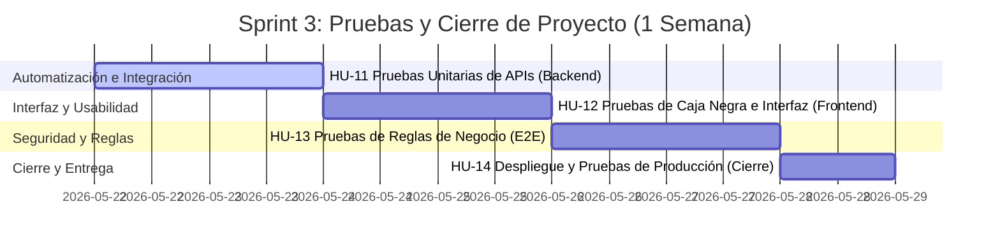

# Plan de Trabajo Scrum: Cierre de Proyecto y Sprint 3 (Pruebas)
## Proyecto: Sabores de Tlaxcala - Secretaría de Turismo

Este reporte detalla el estado actual del Tablero Scrum al inicio de la **última semana**, indicando qué Historias de Usuario (HUs) del backlog ya deben pasar al estado **`DONE`** (Completado) y estructurando el backlog técnico para el **Sprint 3 (Destinado a Pruebas y Cierre)**.

---

## 1. Actualización del Tablero Scrum (Estado de HUs Actuales)

Dado el estado del desarrollo actual del sistema (con el backend modular en Express + MongoDB Atlas funcionando y el cliente en React fully integrated), **todas las HUs de desarrollo e inicialización ya deben moverse a `DONE`**.

Aquí tienes el mapeo exacto para actualizar tu tablero (de acuerdo a tu captura de pantalla):

| ID | Historia de Usuario (HU) | Estado Anterior | Estado Nuevo | Justificación Técnica de Cierre |
| :--- | :--- | :--- | :--- | :--- |
| **HU-00** | Levantamiento de Requisitos | `DONE` | **`DONE`** | Definición completa de requerimientos y las 6 secciones de la Secretaría de Turismo. |
| **HU-00** | Definición de Arquitectura (4+1) | `DONE` | **`DONE`** | Documentación técnica entregada en 4+1 vistas (Lógica, Proceso, Desarrollo, Física, Escenarios). |
| **HU-00** | Configuración técnica inicial | `EN CURSO` | **`DONE`** | Configuración de entornos de Node, scripts de `package.json` y variables en `.env`. |
| **HU-01** | Registro de Usuarios | `EN CURSO` | **`DONE`** | Pantalla de registro en React con validación de Captcha matemático interactivo y llamadas a la base de datos NoSQL. |
| **HU-02** | Inicio de Sesión (Login) | `EN CURSO` | **`DONE`** | Inicio de sesión con autenticación basada en JWT y protección de vistas por roles (`visitante`, `usuario`, `admin`). |
| **HU-03** | Estructura del Servidor (Boilerplate) | `IN REVIEW` | **`DONE`** | Estructura del servidor Express modular en capas (`domain`, `infrastructure`, `interfaces`) aprobada. |
| **HU-04** | Esquema y Conexión NoSQL | `IN REVIEW` | **`DONE`** | Conexión a MongoDB Atlas y esquemas Mongoose de `User` y `Recipe` con validación estricta. |
| **HU-05** | Perfil de Usuario Básico | `EN CURSO` | **`DONE`** | Inyección de datos de sesión en cabeceras de React, visualización de origen/especialidad de las cocineras tradicionales. |
| **HU-06** | Creación de Recetas (6 Secciones) | `IN REVIEW` | **`DONE`** | Formulario `RecipeFormModal` con carga interactiva de las 6 secciones obligatorias, incluyendo calorías. |
| **HU-07** | Visualización de Recetas (Feed/Lista) | `EN CURSO` | **`DONE`** | Renderizado del catálogo de recetas aprobadas en Home y en la página principal `/recetas`. |
| **HU-08** | Detalle de Receta Individual | `IN REVIEW` | **`DONE`** | Modal con navegación por pestañas de Receta (Ingredientes/Pasos), Historia (Breviario) y Datos Curiosos. |
| **HU-09** | Edición y Borrado de Recetas propias | `EN CURSO` | **`DONE`** | Integración del CRUD con validación de autoría (propietario) o rol de administrador para modificar/eliminar. |
| **HU-10** | Buscador y Filtros básicos | `EN CURSO` | **`DONE`** | Filtrado interactivo e inmediato en el cliente por categorías gastronómicas. |

---

## 2. Planificación del Sprint 3: Historias y Tareas de Pruebas (QA)

El **Sprint 3** representa la última semana y está enfocado en la **Garantía de Calidad (QA), Pruebas de Aceptación, Afinación Estética y Despliegue**.

A continuación se detallan las **nuevas Historias de Usuario de Pruebas** que debes dar de alta en tu backlog de Sprint 3 con sus respectivas tareas técnicas asociadas:

### HU-11: Pruebas Unitarias y de APIs (Capa de Backend)
*   **Descripción**: Como *Desarrollador Backend*, quiero ejecutar un conjunto de pruebas funcionales automatizadas e instrumentales a los controladores para certificar la estabilidad de los servicios REST.
*   **Tareas**:
    *   **Tarea 11.1**: Realizar pruebas de caja negra en Postman / ThunderClient para verificar respuestas HTTP adecuadas (200 OK, 201 Created, 400 Bad Request, 401 Unauthorized, 403 Forbidden).
    *   **Tarea 11.2**: Probar la robustez de los middlewares de seguridad (`protect` y `adminOnly`) inyectando JWT alterados o expirados.
    *   **Tarea 11.3**: Validar el validador estricto del Mongoose Schema para inserciones sin el campo `calories` o sin imágenes para certificar que la BD rechaza registros incompletos.

### HU-12: Pruebas de Caja Negra y UX (Capa de Frontend)
*   **Descripción**: Como *Diseñador UX / QA*, quiero realizar pruebas de interacción directa en la UI para garantizar que los flujos visuales no presenten errores de renderizado y sean responsivos.
*   **Tareas**:
    *   **Tarea 12.1**: Pruebas de compatibilidad responsiva (Mobile-First) en Chrome DevTools emulando pantallas móviles (iPhone/Android) y tablets para verificar que las tarjetas de recetas y modales se adapten adecuadamente.
    *   **Tarea 12.2**: Pruebas de resiliencia del formulario: Intentar enviar recetas incompletas (sin el breviario histórico o calorías) y corroborar que el frontend despliega correctamente el aviso de error en color rojo.
    *   **Tarea 12.3**: Validación del Captcha del registro: Comprobar que al teclear un resultado erróneo el sistema efectivamente frena el registro, y al refrescar el modal la ecuación matemática cambia aleatoriamente.

### HU-13: Pruebas de Integración y Reglas de Negocio (Flujo E2E)
*   **Descripción**: Como *Product Owner / Secretaría de Turismo*, quiero probar los flujos cruzados completos (End-to-End) del sistema para certificar el cumplimiento estricto de las reglas del negocio de los roles.
*   **Tareas**:
    *   **Tarea 13.1**: Probar el **Flujo de Propuesta y Aprobación**: Registrar una cocinera -> Añadir receta -> Corroborar que entra como pendiente y NO es visible al visitante -> Loguear Administrador -> Aprobar receta -> Corroborar que ya es visible al público general en `/recetas`.
    *   **Tarea 13.2**: Probar el **Control Total del Admin**: Iniciar sesión como admin -> Navegar a pestaña de *Usuarios* -> Togglear el rol de un usuario y verificar que cambia a administrador -> Eliminar un usuario de prueba -> Comprobar que se remueve de la base de datos.
    *   **Tarea 13.3**: Probar la **Seguridad del PIN Maestro**: Tratar de crear un administrador con un PIN diferente a `'1234'` y comprobar el rechazo del controlador.

### HU-14: Despliegue y Pruebas en Ambiente Productivo
*   **Descripción**: Como *DevOps / Release Manager*, quiero desplegar la aplicación en un entorno de producción en la nube (Vercel / Render / MongoDB Atlas) para garantizar el acceso global y libre de errores.
*   **Tareas**:
    *   **Tarea 14.1**: Ejecutar el script `npm run build` en el frontend para empaquetar de forma óptima los recursos estáticos (CSS Vanilla purgado, JS minimizado y sin logs de depuración).
    *   **Tarea 14.2**: Realizar la migración definitiva de la base de datos en la nube (MongoDB Atlas) configurando las variables de entorno de producción.
    *   **Tarea 14.3**: Realizar pruebas de humo (Smoke Tests) en la URL de producción final simulando un acceso de visitante de manera externa.
